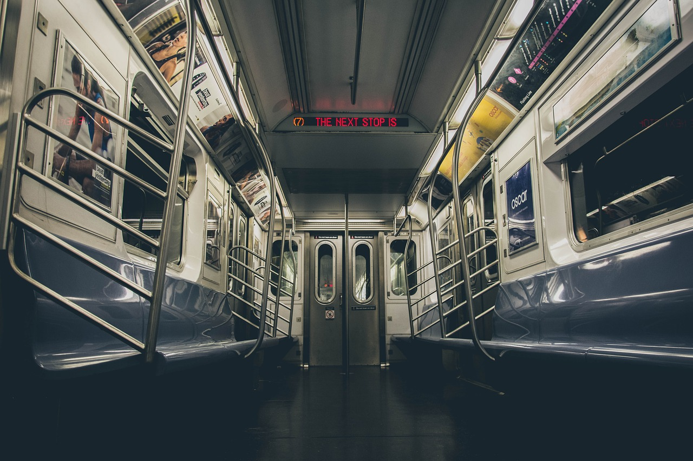
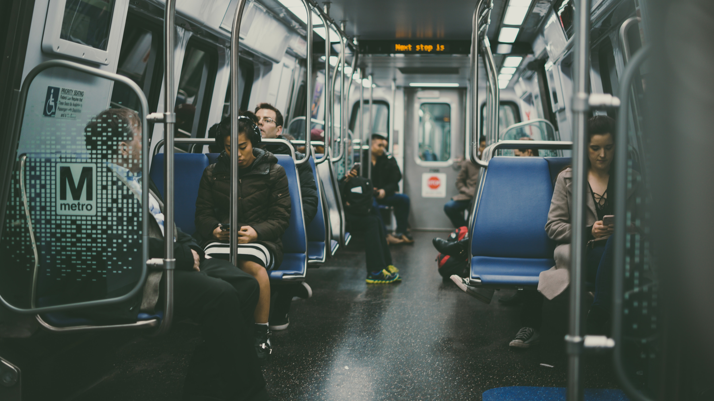

De eerste twee jaar van mijn studie communicatie woonde ik bij mijn ouders in Moordrecht, een
dorpje naast Gouda waar je niet dood gevonden wil worden. Elke dag fietste ik een halfuur naar het
station van de kaasstad om vervolgens op de trein te stappen naar Rotterdam. 

Ik had er een
pesthekel aan. Elke dag liep ik met mijn fiets aan mijn hand gehaast rondjes rond het fietsenrek, in de
hoop om een plekje te vinden. Zodra ik hem ergens tussen had gepropt, moest ik mijn tas overhoop
halen om mijn ov-chipkaart te vinden. Eenmaal door de incheckpoortjes wilde ik sprinten naar het
perron, maar werd tegengehouden door de menigte. Net zoals er iemand voor je loopt die iets
langzamer loopt dan jou, maar je kan hem niet inhalen. Super irritant.
Maar het ergste vind ik nog wel als je de trein ingaat. Zodra de deuren opengaan en men in kan
stappen, is het dringen geblazen. Mensen die voor je staan met gigantische rugzakken beuken tegen
je aan, waardoor je met je neus in hun tas komt en kan ruiken wat er in hun lunchpakketje zit. 

En eenmaal in de coupe elke keer weer heel ongemakkelijk bij een stoel langzaam je rugzak afdoen,
zodat de persoon die naast je zit opkijkt en snel zijn tas weghaalt zodat je kan zitten. Ja, zitten moest
ik altijd, staan was geen optie. Want ik verdiende het wel om neer te ploffen na die barre fietstocht.
Zodra ik in de bruin bevlekte stoel zat, zette ik mijn koptelefoon op en drukte op suffle van mijn
discohouse-afspeellijst. Afgesloten van alles en iedereen, voorbereidend op een nieuwe dag.
Op een dag was mijn koptelefoon leeg. En dat is erg, want muziek luisteren en tussendoor een beetje
facebooken in de trein is onderdeel van mijn ochtendroutine. Chagrijnig keek ik uit het raam naar de
bomen die voorbij schoten. Terwijl ik aan het nadenken was over een schoolopdracht, hoorde ik
opeens: ‘mevrouw, wilt u misschien zitten?’. Toen ik opkeek, zag ik een paar meter voor me een
oude vrouw staan. Ze glimlachte en bedankte een jonge man die opstond vanuit zijn stoel en de
vrouw liet zitten.
Perplex keek ik naar de jonge man. Mijn god, dit zie je echt nergens meer. En dat terwijl het zoiets
simpels is; om je heen kijken of er een oudere of een zwangere vrouw staat die nergens kan zitten.
Zijn we hier niet mee opgevoed? Is dit niet een algemene norm? Net zoals dat je eerst mensen uit
een trein laat stappen voordat je er zelf in gaat? We lijken het vergeten te zijn. Of te zijn afgeleid
door onze mobiele telefoon. Beschouw deze blog als een reminder. Heb wat meer oog voor elkaar.