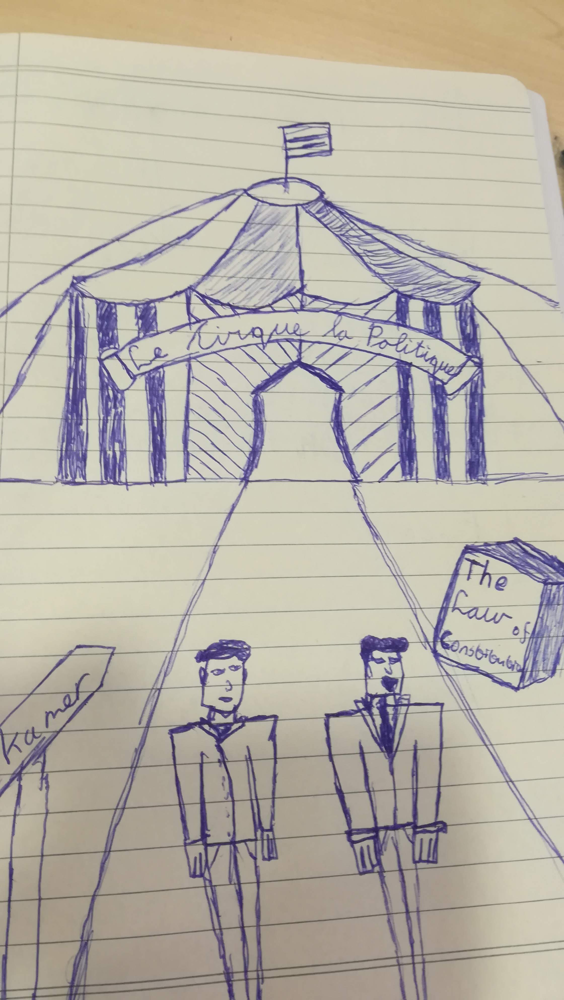

We zijn een nieuw blok in gegaan met de minor, dat van public affairs en media. Dat betekend dat we op de helft zijn van de minor. We begonnen de week met een serie gastcolleges van lobbyist Frans van Drimmelen en PA deskundige Koen Burgerhout. De week eindigde in de plenaire zaal van de tweede kamer, waar we een politiek debat hadden bijgewoond.

We waren zelf in het begin wat sceptisch over de politiek, we wisten niet goed wat er precies gebeurde in de tweede kamer en zagen het eerst meer als een plek voor politici om een beste kunstjes te laten zien voor de camera. Vandaar ook de titel het politieke circus. Want als je maar van een grote afstand naar de politiek kijkt en  naar de kamer dan zie je alleen maar  politici die voor elkaar gaan staan en als eerste op het journaal willen komen. Dan zie je Jesse Klaver die jongleert met de laatste actualiteiten, Geert Wilders die als een gorilla op zijn borst slaat en iedereen laat weten dat het niet goed gaat met Nederland en Mark Rutte die staat te koorddansen met onder zich een menigte demonstranten en een horde politici van de oppositie.

 

> Dan zie je Jesse Klaver die jongleert met de laatste actualiteiten, Geert Wilders die als een    gorilla op zijn borst slaat en iedereen laat weten dat het niet goed gaat met Nederland en       Mark Rutte die staat te koorddansen met onder zich een menigte demonstranten en een horde        politici van de oppositie.
 

Nu we de kamer van dichtbij heb bekeken, in detail heb geluisterd naar wat er gezegd werd 

en na een diepte interview en gesprek met CDA kamerlid Evert-Jan Slootweg, kreeg ik een beter beeld van de politiek. Dat een politici wel degelijk het beste voorheeft met de mensen en niet alleen maar handelt naar eigen belang. Dat kamerleden ook hun mening en standpunten aanpassen aan de hand van signalen van de maatschappij. Iedereen stelde ook best diepgaande vragen aan het kamerlid, waardoor we zelfs iets over zijn tijd heen gingen. 

Wat ik voornamelijk verwacht van dit public affairs blok is hoe je de politiek kunt beïnvloeden en hoe je de politici een nieuw kunstje kunt laten doen in de tweede kamer. Want ik zie nu ook in dat wat er in de kamer besproken wordt gevolgen kan hebben voor het hele land en dat gewone burgers ook zo hun invloed uit kunnen oefenen op de politiek en dus op het land. 

 

Politiek is niet alleen maar de baas spelen en vertellen dat anderen het verkeerd doen, van als we nu niet veranderen gaat alles verkeerd. Politiek gaat over het zorgen voor het land, de juiste beslissingen maken, zorgen dat iedereen zich gehoord voelt en rekening houden met iedereens belangen. 

 

Kortom politiek gaat over jou, politiek gaat over ons!