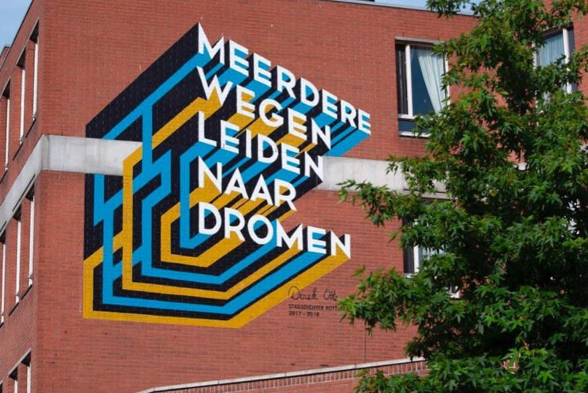

Deze week kwam woordkunstenaar en voormalig stadsdichter Derek Otte langs voor een inspiratie college op de Hogeschool. Hij vertelde over zichzelf zijn opdrachtgevers en hoe hij op al zijn ideeën kwam. In de minor staat natuurlijk verhalen vertellen en werken vanuit de context centraal en als iemand dat kan is dat natuurlijk Derek Otte. Want hoe neem je creatieve beslissingen? En hoe zet je een creatieve opdracht in op een zakelijk gebied? Want geld verdienen is ook belangrijk. 

 

Wat mij voornamelijk is bijgebleven van het gastcollege is de manier waarop Derek schrijft, schrijven is een moment opname. Ik schrijf wat ik op dat moment voel. Zo vertelde hij over zijn eerste dichtbundel Tof Lof, over hoe moeilijk de liefde soms kan zijn in een grote stad als Rotterdam. Hoe hij het boek ziet als zijn eigen hart dat hij op tafel legt en openmaakt. In zijn volgende bundel staat zijn hoofd centraal en wordt dat opengemaakt, daar zou je niet willen wonen grapt Derek. 

 

> Op dit moment is het voor hem alsof hij in een droom leeft.
 

Derek heeft een hoop over zichzelf vertelt, over Rotterdam West waar hij opgroeide, over zijn studie communicatie die hij niet heeft afgemaakt, zijn aankomende theatertour. Op dit moment is het voor hem alsof hij in een droom leeft. Zo eindigde hij met de tekst meerdere wegen leiden naar dromen. 