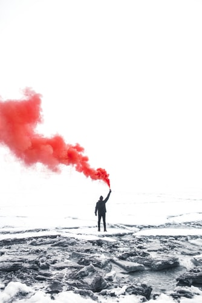

Zelfbesturende auto’s, volledig geïntegreerde supermarkten en slimme chatbots die vertellen wat jij moet doen, de technologische ontwikkelingen groeien met de dag en nemen steeds meer taken van ons, de mens, over. En is dit prettig? Ik weet het zo net niet…

De technologische ontwikkelingen volgen elkaar de laatste jaren in rap tempo op. We hebben vast allemaal weleens het gevoel dat we het niet meer kunnen bijhouden, niet? Of erger nog: dat we ingehaald worden door de technologie, dat we zelflerende systemen ontwikkelen die zo slim worden dat ze ons voorbij streven. 

 

> Wordt het tijd dat we de zeggenschap over onze eigen levens gaan terugeisen?
 

Een trend die nu erg naar voren aan het schuiven is dat de technologie overschat wordt en de mens onderschat. Mensen worden voor het blok gezet omdat ze moeten kiezen tussen mens en technologie. Dit zorgt voor verdeling onder de maatschappij; mensen die wel kiezen voor technologie versus de mensen die dat niet doen. 

 

We zouden hier een mooie middenweg in moeten vinden. Op bepaalde vlakken de technologie omarmen maar soms ook even dat menselijke naar voren brengen. Zo mis ik het heel erg dat we niet meer met elkaar bellen, praten en iets leuks schrijven via een kaartje. Dit gebeurt wel, maar bijna alles via de technologie. 

 

We appen, sms’en en dm’en elkaar, veel onpersoonlijker. Feliciteren gebeurt via de WhatsApp en wanneer iemand hier dan iets over zegt dan is dat juist raar. Wanneer je in de metro zit iedereen aan z’n scherm geplakt. Waar was de tijd dat we geen telefoon meer hadden en met elkaar een fatsoenlijk gesprek hadden? Misschien klink ik nu ouderwets, maar ik mis soms gewoon heel erg dat een-op-een contact. Ik geloof er heilig in, dat je dan veel meer kan bereiken dan dat er een technologie tussen zit.

 

> Wordt het tijd dat we de zeggenschap over onze eigen levens gaan terugeisen?
 

Natuurlijk zitten er ook mooie aspecten aan de technologie. Zo kun je met iemand communiceren die mijlenver van jou vandaan zit. Voor organisaties kan efficiëntie en effectiviteit worden vergroot door automatisering. Vraag en aanbod kan nog gemakkelijker worden afgestemd van elkaar. Er kunnen meer producten en diensten worden mogelijk gemaakt die het leven van de mens vergemakkelijken. 

 

De techniek moet niet worden onderschat. We moeten de techniek gaan zien als een deel van onszelf, een verlengstuk. Technologie is niet minder natuurlijk dan wij zelf zijn. De technologie maakt ons juist tot wie we zijn. De mens zorgt er immers voor de technologie blijft draaien en daarom blijft de mens de belangrijkste in deze wereld. 